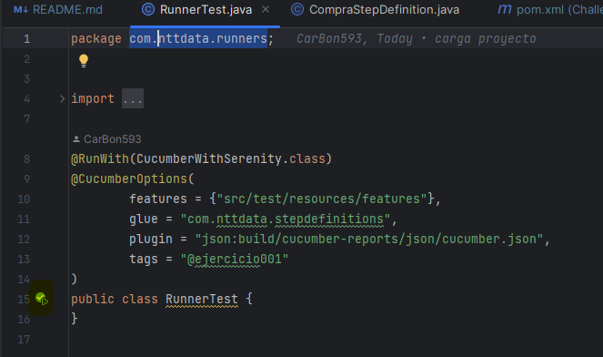

# SERENITYBDD


> **NOTA**:
> * Pre requisitos 
>   * IntelliJ Community
>   * Java 1.8
>   * Maven
> * Una vez obtenido IntelliJ es necesario instalar los plugins de Gherkin y Cucumber for Java. (
    *[Guia de instalación plugins en intellij](https://www.jetbrains.com/help/idea/managing-plugins.html)*)

## Ejecución

0. Clonar el proyecto

```bash
  git clone https://github.com/CarBon593/challengeE2E.git
```

Para correr el proyecto se debe realizar lo siguiente:

Definir el tag de los tests que se van a ejecutar,en el archivo RunnerTest. 

```
tags = "@ejercicio001"
```
Luego dar click en el boton de ejecutar desde el archivo runner.




## Documentacion

[Manual SerenityBDD](https://serenity-bdd.github.io/docs/guide/user_guide_intro)

